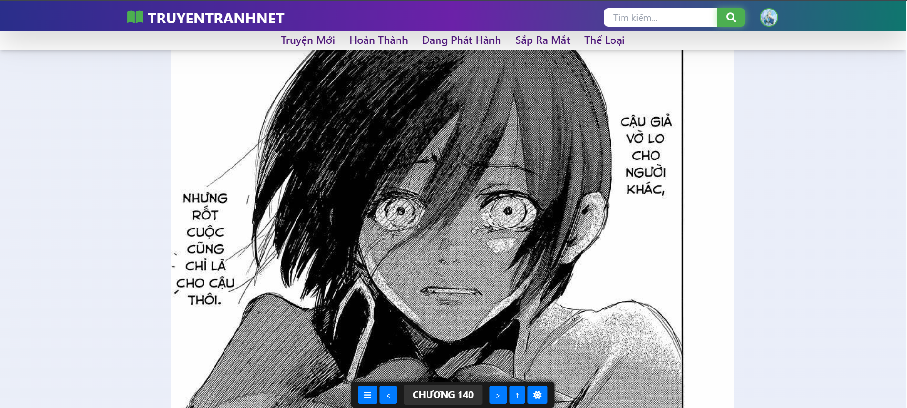
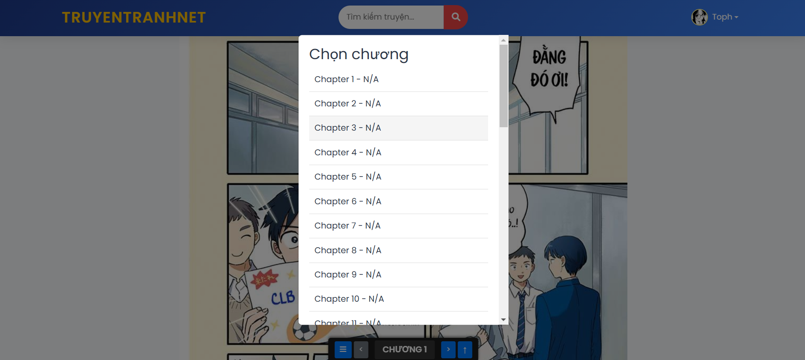
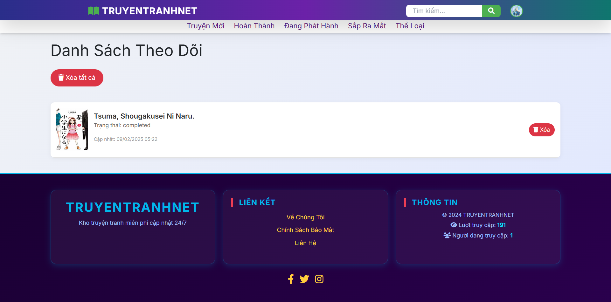
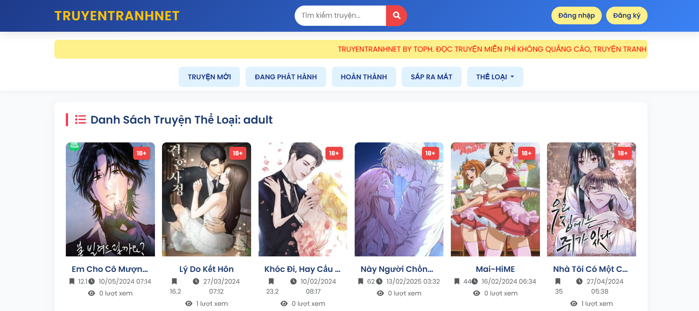
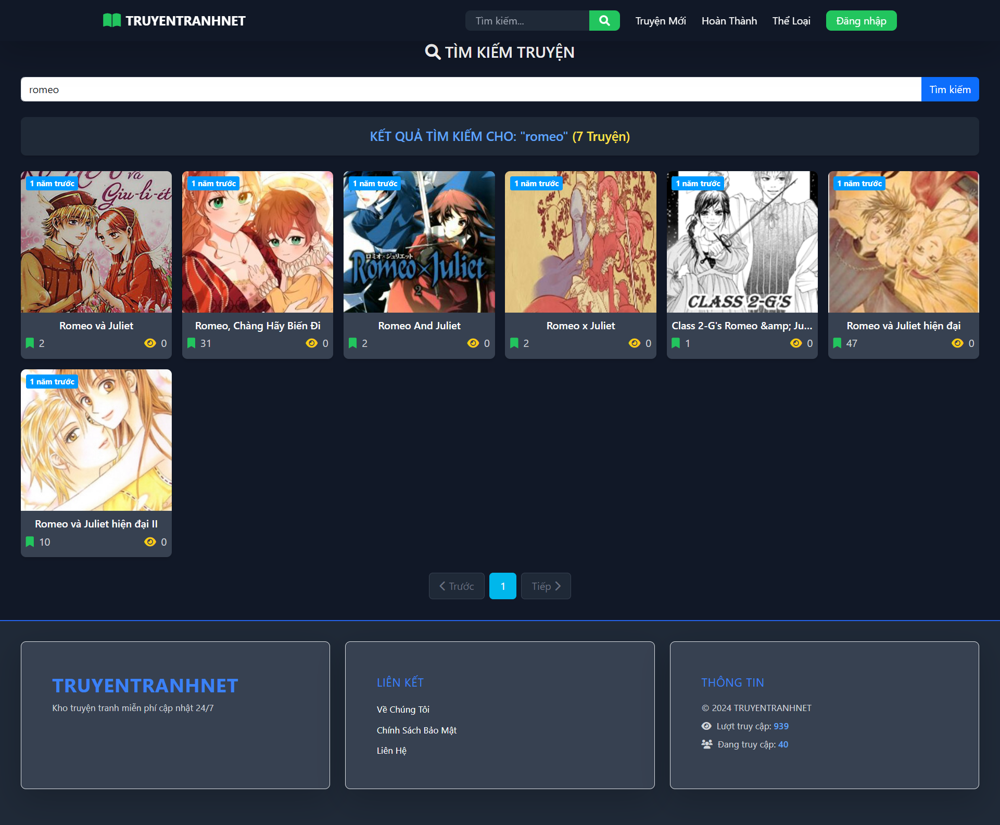

# TruyenTranhNet

TruyenTranhNet là một website đọc truyện tranh trực tuyến miễn phí với nhiều tính năng hỗ trợ người dùng trải nghiệm đọc truyện tốt nhất, tự động update truyện. Hệ thống hỗ trợ tìm kiếm, theo dõi truyện, đăng nhập bằng Google, và mã hóa dữ liệu nhằm đảm bảo an toàn thông tin.

## 📌 Ảnh Demo


- **Trang thông tin truyện**  
  
- **Giao diện đọc truyện**  
  
- **Chọn chương, Back to top, chuyển tập**  
  
- **Trang danh sách theo dõi**  
  
- **Trang tìm truyện theo thể loại**  
  
- **Trang đăng nhập**  
  
- **Trang tìm kiếm**  
  

## ✨ Tính năng chính

### 🔍 Tìm kiếm và duyệt truyện
- Người dùng có thể tìm kiếm truyện theo **tên**, **thể loại**.
- Bộ lọc theo **thể loại** giúp dễ dàng tìm kiếm truyện theo sở thích.

### 📖 Đọc truyện
- Giao diện đọc truyện **thân thiện**, hỗ trợ chuyển chương mượt mà.
- Hỗ trợ tính năng **Back to Top**, chọn chương dễ dàng.
- **Danh sách theo dõi** giúp người dùng quản lý truyện yêu thích.

### 🔐 Đăng nhập và bảo mật
- Hỗ trợ đăng nhập bằng **Google**.
- Cho phép **reset mật khẩu** qua email.
- Mã hóa thông tin tài khoản người dùng để tăng cường bảo mật.

### 🔗 Mã hóa API & URL
- Trong `truyen-tranh.php`, **chapter_url** được **mã hóa bằng `base64_encode()`** trước khi đưa vào URL.
- Trong `doc-truyen.php`, **chapter_url** được **giải mã bằng `base64_decode()`** để lấy lại URL gốc.

## 🚀 API sử dụng
- **Nguồn API:** [OTruyen API](https://docs.otruyenapi.com/)
- **Lưu trữ ảnh:** [ImgBB](https://vi.imgbb.com/)

## 💻 Cài đặt và sử dụng
1. Clone repo về máy:
   ```sh
   git clone https://github.com/tophvn/TruyenTranhNet.git
   cd TruyenTranhNet
   ```
2. Cấu hình config/database.php để kết nối database.
3. Chạy project trên local server (Laragon, XAMPP...)
4. Mở trình duyệt và truy cập `http://localhost/TruyenTranhNet`

## 📜 Giấy phép
Dự án này được phát triển phục vụ mục đích học tập và tham khảo. Nếu bạn sử dụng lại mã nguồn, vui lòng ghi nguồn đầy đủ.
